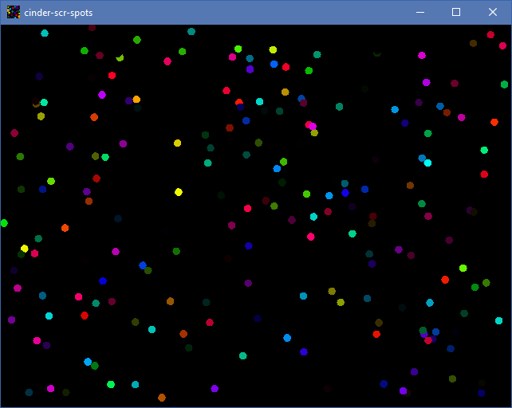

# cinder-scr-spots
A bunch of random colorful spots appearing and disappearing on your screen.

# Build instructions
* download latest [Cinder SDK](https://libcinder.org/download) (this project was tested with [v0.9.0](https://github.com/cinder/Cinder/tree/release_v0.9.0))
* add environment variable named `CINDERDIR` that points to where your Cinder installation folder is (for example: `c:\sdk\cinder`) 
* open solutions file at `.\shapes\vs2015\spots.sln` and build it
* in `DEBUG` configuration project will be compiled as App (normal Window with controls), while in `RELEASE` it will generate Windows screensaver (exits on mouse events, fullscreen etc)

# TODO
* configurable options
* randomize logic to add more chaos (currently it is possible to see some sequences)